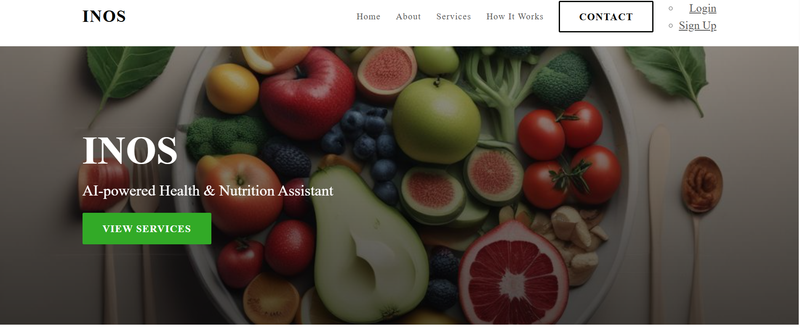
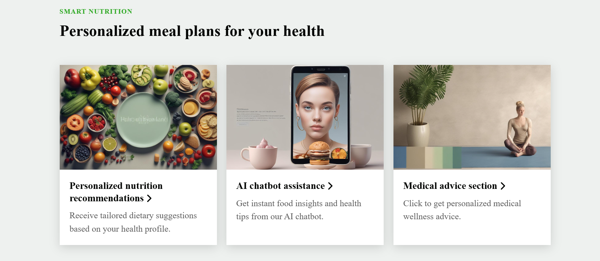
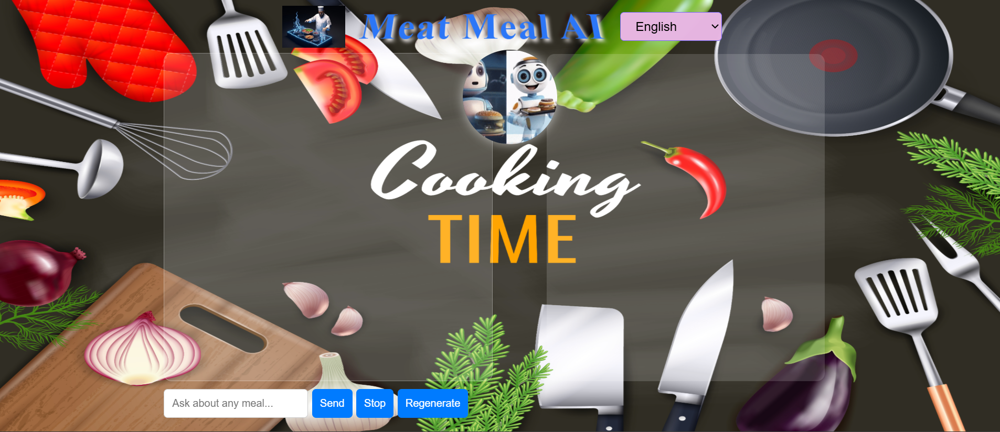

Absolutely! Here's the **complete `README.md`** – just copy and paste this into your `README.md` file in VS Code.

---

```markdown
# INOS 🍽️  
**Intelligent Nutrient Optimization System**

INOS is a smart food recommendation and chatbot system that provides personalized meal suggestions based on user inputs such as age, gender, and specific diseases. It also offers step-by-step recipes, ingredients, and YouTube video guides for preparing healthy meals.

---

## 🚀 Features

- 🧠 **AI Chatbot** – Ask food-related queries and get intelligent, friendly responses.
- 🍱 **Personalized Meal Recommender** – Suggests meals based on user's age, gender, and health condition.
- 🍽️ **Detailed Recipe Viewer** – Shows meal ingredients and cooking instructions.
- 🎥 **YouTube Video Integration** – Displays playable cooking videos inside the interface.
- 🌐 **Multi-language Support** – Accepts and responds in English, Hindi, Telugu, Tamil, Kannada, and Malayalam.
- 🖼️ **Modern UI/UX** – 3D split layout with transparent design and animated GIFs.

---

## 🛠️ Tech Stack

- **Frontend**: HTML, CSS, JavaScript
- **Backend**: Python (Flask)
- **Database**: SQLite (`database.db`)
- **APIs**:
  - YouTube Data API (for cooking videos)
  - Free Meal API (for recipe and ingredient data)
- **Other Tools**: Git, GitHub

---

## 📁 Folder Structure

```

INOS/
├── app.py                # Flask backend
├── config.py             # Configuration (API keys, etc.)
├── model.py              # ML/logic modules
├── database.db           # SQLite database
├── index.html            # Main UI
├── index-2.html          # Alternate UI version
├── chatbot/              # Chatbot HTML, JS, CSS
├── chat/                 # Chatbot backend code
├── food/                 # JSON files for meals
├── Screenshot/           # Screenshots for README
├── inos.mp4              # Demo video
├── README.md             # Project documentation
└── .gitignore            # Git ignore rules

````

---

## ⚙️ How to Run Locally

### 1. 📥 Clone the Repository

```bash
git clone https://github.com/Sairam-Panuku/INOS.git
cd INOS
````

### 2. 🐍 (Optional) Set Up a Virtual Environment

```bash
python -m venv venv
venv\Scripts\activate   # On Windows
# or
source venv/bin/activate  # On Linux/Mac
```

### 3. 📦 Install Dependencies

```bash
pip install flask
# Add other dependencies if needed
```

### 4. ▶️ Run the Flask App

```bash
python app.py
```

Now open your browser and go to:
👉 `http://127.0.0.1:5000`

---

## 📸 Screenshots

### 🔹 Homepage



---

### 🔹 Features Section



---

### 🔹 Meal Recommendation Page


---

### 🔹 Food Chatbot



---

## 🎬 Demo Video (Optional)

👉 [Watch Demo Video](inos.mp4)

*Note: GitHub doesn't support direct playback of `.mp4`, but the file is downloadable.*

---

## 👨‍💻 Author

**Sairam Panuku**
GitHub: [@Sairam-Panuku]

---


